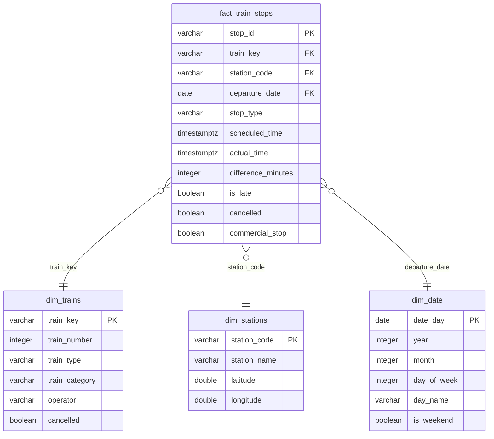

# VR Rautatieliikenne — Tietoalusta

Dataputki, joka hakee junaliikenteen tiedot Digitrafficin avoimesta rajapinnasta ja jalostaa ne analysoitavaksi ja visualisoitavaksi dataksi.

## Projektin tavoite

Vastata kysymyksiin kuten:
- Milloin junat ovat tyypillisesti asemalla?
- Kuinka paljon junia myöhästelee, ja millä asemilla?
- Mikä on täsmällisyystilanne eri reiteillä?

## Arkkitehtuuri

```
VR API (rata.digitraffic.fi)
        │
        ▼
  01_fetch/          ← Python + requests: haetaan raaka JSON
        │
        ▼
  02_staging/        ← Tallennetaan sellaisenaan, TTL 14 pv
        │
        ▼
  03_bronze/         ← Polars: minimaaliset muunnokset, tiedostojärjestelmä
        │
        ▼
  04_silver/         ← DuckDB + dbt: puhdistettu tähtimalli
        │
        ▼
  05_gold/           ← DuckDB + dbt: aggregaatit loppukäyttäjälle
        │
        ▼
  07_visualisation/  ← Streamlit-dashboard + Jupyter Notebook
```

## Tietomalli (silver-kerros)

DuckDB:n tähtimalli — `fact_train_stops` yhdistää kaikki dimensiot.



Gold-kerroksen aggregaattitaulut (`gold_station_punctuality`, `gold_daily_punctuality`) on kuvattu [05_gold/README.md](05_gold/README.md):ssä.

## Pikaohje

### 1. Asennus

```bash
# Kloonaa repo ja siirry kansioon
git clone <repo-url>
cd vr-data-platform

# Luo virtuaaliympäristö ja asenna riippuvuudet yhdellä komennolla
uv sync --extra dev

# Aktivoi ympäristö
source .venv/bin/activate        # Linux/Mac
# .venv\Scripts\activate         # Windows
```

### 2. Ympäristömuuttujat

```bash
cp .env.example .env
# Muokkaa .env tarvittaessa (API ei vaadi avainta, mutta User-header on pakollinen)
```

### 3. Aja dataputki

```bash
# Vaihe 1: Hae data API:sta → staging
python 01_fetch/fetch_trains.py

# Vaihe 2: Bronze-muunnos
python 03_bronze/bronze.py

# Vaihe 3: Silver + Gold (dbt)
cd 06_transform
dbt run
dbt test
dbt docs generate && dbt docs serve --port 8085  # avaa dokumentaatio selaimeen

# Vaihe 4: Käynnistä dashboard
uv run streamlit run 07_visualisation/app.py
# → Avautuu osoitteeseen http://localhost:8501

# Vaihtoehtoisesti: Jupyter Notebook
jupyter notebook 07_visualisation/analysis.ipynb
```

### 4. Testit

```bash
pytest
# Tai kattavuusraportin kanssa:
pytest --cov=. --cov-report=html
```

## Hakemistorakenne

| Kansio | Tarkoitus |
|--------|-----------|
| `01_fetch/` | API-haku: Python + requests |
| `02_staging/` | Raaka JSON-data, TTL-hallinta |
| `03_bronze/` | Minimaaliset muunnokset, Polars |
| `04_silver/` | Puhdistettu data, tähtimalli, DuckDB |
| `05_gold/` | Aggregaatit, valmiit kyselyt |
| `06_transform/` | dbt-projekti (mallit, testit, dokumentaatio) |
| `07_visualisation/` | Streamlit-dashboard (`app.py`) + Jupyter Notebook |
| `tests/` | Yksikkötestit (pytest) |
| `docs/` | Lisädokumentaatio |

## Riippuvuudet

Kaikki riippuvuudet löytyvät `pyproject.toml`-tiedostosta.  
Lyhyesti: `requests`, `polars`, `duckdb`, `dbt-duckdb`, `streamlit`, `plotly`, `jupyter`, `matplotlib`, `seaborn`, `ipywidgets`.

## Datalähde ja lisenssi

Data: [Digitraffic — rata.digitraffic.fi](https://rata.digitraffic.fi)  
Omistaja: Fintraffic Oy  
Lisenssi: [Creative Commons Attribution 4.0](https://creativecommons.org/licenses/by/4.0/)

## dbt-dokumentaatio

Aja `cd 06_transform && dbt docs generate && dbt docs serve --port 8085` — avautuu osoitteeseen `http://localhost:8085`.

## Tuki ja kehitysehdotukset

Digitrafficin kehittäjäryhmä: [rata.digitraffic.fi Google Groups](https://groups.google.com/g/rata.digitraffic.fi)
