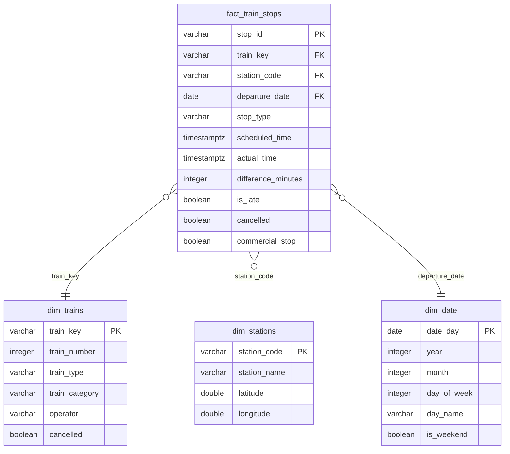

# VR Rautatieliikenne — Tietoalusta

Dataputki, joka hakee junaliikenteen tiedot Digitrafficin avoimesta rajapinnasta ja jalostaa ne analysoitavaksi ja visualisoitavaksi dataksi.

## Sisällys

- [Projektin tavoite](#projektin-tavoite)
- [Arkkitehtuuri](#arkkitehtuuri)
- [Tietomalli (silver-kerros)](#tietomalli-silver-kerros)
- [Streamlit-dashboard](#streamlit-dashboard)
- [Pikaohje](#pikaohje)
  - [1. Asennus](#1-asennus)
  - [2. Ympäristömuuttujat](#2-ympäristömuuttujat)
  - [3. Aja dataputki](#3-aja-dataputki)
  - [4. Testit](#4-testit)
- [Hakemistorakenne](#hakemistorakenne)
- [Riippuvuudet](#riippuvuudet)
- [Huomioita API-käytöstä](#huomioita-api-käytöstä)
- [Datalähde ja lisenssi](#datalähde-ja-lisenssi)
- [dbt-dokumentaatio](#dbt-dokumentaatio)
- [Tuki ja kehitysehdotukset](#tuki-ja-kehitysehdotukset)

## Projektin tavoite

Vastata kysymyksiin kuten:
- Milloin junat ovat tyypillisesti asemalla?
- Kuinka paljon junia myöhästelee, ja millä asemilla?
- Mikä on täsmällisyystilanne eri reiteillä?
- Missä junat ovat juuri nyt?

## Arkkitehtuuri

```
VR API (rata.digitraffic.fi)
        │
        ▼
  01_fetch/          ← Python + requests: haetaan raaka JSON
        │
        ▼
  02_staging/        ← Tallennetaan sellaisenaan, TTL 14 pv
        │
        ▼
  03_bronze/         ← Polars: minimaaliset muunnokset, tiedostojärjestelmä
        │
        ▼
  04_silver/         ← DuckDB + dbt: puhdistettu tähtimalli
        │
        ▼
  05_gold/           ← DuckDB + dbt: aggregaatit loppukäyttäjälle
        │
        ▼
  07_visualisation/  ← Streamlit-dashboard + Jupyter Notebook
```

## Tietomalli (silver-kerros)

DuckDB:n tähtimalli — `fact_train_stops` yhdistää kaikki dimensiot.



Gold-kerroksen aggregaattitaulut (`gold_station_punctuality`, `gold_daily_punctuality`) on kuvattu [05_gold/README.md](05_gold/README.md):ssä.

## Streamlit-dashboard

Dashboard (`07_visualisation/app.py`) sisältää seuraavat välilehdet:

| Välilehti | Sisältö |
|-----------|---------|
| 🗺️ Kartta | Asemien täsmällisyys kartalla (koko = pysähdysmäärä, väri = täsmällisyys-%) |
| 📅 Päivittäinen | Täsmällisyys- ja myöhästymistrendit päivittäin + junamäärä viikonpäivittäin |
| 🏢 Asemat | Top/bottom N täsmällisintä asemaa |
| 📊 Jakauma | Myöhästymisjakauma ja kumulatiivinen käyrä |
| 🔍 Asema-analyysi | Yksittäisen aseman aikasarjaanalyysi |
| 🔴 Live | Junien reaaliaikaiset sijainnit kartalla |

### Live-välilehti

Hakee reaaliaikaiset sijaintitiedot suoraan Digitraffic-rajapinnasta napin painalluksella — ei vaadi muutoksia dataputkeen.

- Näyttää junan nimen (esim. IC29, S14), nopeuden, lähtöaseman, määränpään ja aikataulun mukaisen saapumisajan
- Lähellä toisiaan olevat junat ryhmittyvät klusteriksi zoomatessa ulos, ja erkaantuvat zoomatessa sisään
- Pysähtyneet junat (0 km/h) voi piilottaa valintaruudulla
- Pisteiden väri kertoo nopeuden (sininen = hidas → punainen = nopea)

## Pikaohje

### 1. Asennus

```bash
# Kloonaa repo ja siirry kansioon
git clone https://github.com/arttujussikil/jaateloauto.git
cd jaateloauto

# Luo virtuaaliympäristö ja asenna riippuvuudet yhdellä komennolla
uv sync --extra dev

# Aktivoi ympäristö
source .venv/bin/activate        # Linux/Mac
source .venv/Scripts/activate    # Windows (Git Bash)
.venv\Scripts\activate           # Windows (Command Prompt)
.venv\Scripts\Activate.ps1       # Windows (PowerShell)
```

### 2. Ympäristömuuttujat

```bash
cp .env.example .env       # Linux/Mac/Git Bash
copy .env.example .env     # Windows (Command Prompt)
```

Muokkaa `.env` tarvittaessa — API ei vaadi avainta, mutta `Digitraffic-User`-header on pakollinen ja asetetaan automaattisesti oletusarvolla.

### 3. Aja dataputki

Suositeltava tapa — `run_pipeline.py` ajaa kaikki vaiheet järjestyksessä:

```bash
# Viimeiset 7 päivää (oletus)
python run_pipeline.py

# Kuukauden data + avaa dashboard automaattisesti
python run_pipeline.py --days-back 30 --visualise

# Vain tietty vaihe
python run_pipeline.py --only fetch
python run_pipeline.py --only gold
```

Tai manuaalisesti vaihe kerrallaan:

```bash
python 01_fetch/fetch_trains.py --days-back 30
python 03_bronze/bronze.py --all
cd 06_transform && dbt run && dbt test
uv run streamlit run 07_visualisation/app.py
```

Jupyter Notebook:

```bash
jupyter notebook 07_visualisation/analysis.ipynb
```

### 4. Testit

```bash
pytest
# Tai kattavuusraportin kanssa:
pytest --cov=. --cov-report=html
```

## Hakemistorakenne

| Kansio | Tarkoitus |
|--------|-----------|
| `01_fetch/` | API-haku: Python + requests |
| `02_staging/` | Raaka JSON-data, TTL-hallinta |
| `03_bronze/` | Minimaaliset muunnokset, Polars |
| `04_silver/` | Puhdistettu data, tähtimalli, DuckDB |
| `05_gold/` | Aggregaatit, valmiit kyselyt |
| `06_transform/` | dbt-projekti (mallit, testit, dokumentaatio) |
| `07_visualisation/` | Streamlit-dashboard (`app.py`) + Jupyter Notebook |
| `tests/` | Yksikkötestit (pytest) |
| `docs/` | Lisädokumentaatio |

## Riippuvuudet

Kaikki riippuvuudet löytyvät `pyproject.toml`-tiedostosta.  
Lyhyesti: `requests`, `polars`, `duckdb`, `dbt-duckdb`, `streamlit`, `plotly`, `jupyter`, `matplotlib`, `seaborn`, `ipywidgets`.

## Huomioita API-käytöstä

- `Digitraffic-User`-otsikko on pakollinen 1.12.2024 alkaen (asetetaan automaattisesti)
- Fetch-skripti odottaa 0,5 s pyyntöjen välissä
- 429 Too Many Requests -virheeseen reagoidaan automaattisesti: 3 uudelleenyritystä odotuksilla 5 s → 10 s → 15 s
- Staging-tiedostot välimuistitetaan (TTL 14 pv) — jo haettujen päivien tietoja ei haeta uudelleen

## Datalähde ja lisenssi

Data: [Digitraffic — rata.digitraffic.fi](https://rata.digitraffic.fi)  
Omistaja: Fintraffic Oy  
Lisenssi: [Creative Commons Attribution 4.0](https://creativecommons.org/licenses/by/4.0/)

## dbt-dokumentaatio

Aja `cd 06_transform && dbt docs generate && dbt docs serve --port 8085` — avautuu osoitteeseen `http://localhost:8085`.

## Tuki ja kehitysehdotukset

Digitrafficin kehittäjäryhmä: [rata.digitraffic.fi Google Groups](https://groups.google.com/g/rata.digitraffic.fi)
